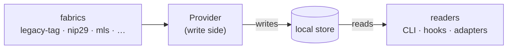

# tenex-edge — Fabric Architecture (overview)

> The one-page version. For the schema, capabilities, and migration plan, see
> [`fabric-architecture.md`](./fabric-architecture.md).

## The one idea

**Everything is read from a single local store. How the data got there is
irrelevant to anyone reading it.**

That's the whole design. A *fabric* — legacy-tag notes, NIP-29 groups, MLS, a future
a2a, whatever — is a detail that lives on the write side. Readers never see it.

- **Readers** ask plain questions: *which projects exist, who's in them, who's
  online, what are they doing, which threads, which messages, who do I reply to.*
  Every one is a query against the store. None of them know or care which fabric
  is in play.
- **A Provider** is the swap-seam. It subscribes to its fabric, decodes, decides
  what's allowed in, and writes canonical rows. Swapping fabrics means swapping
  the Provider — nothing a reader touches changes.

## Two faces, one contract

The seam has two sides, and only one is ever in a reader's path:

| | What it is | Who depends on it |
|---|---|---|
| **Read face** | the store's shape (projects, agents, membership, presence, threads, messages, recipients) | every reader — this is *the* contract |
| **Write face** | the Provider — materializes inbound, publishes outbound | nobody reads through it |

So there are two kinds of verb: **reads** (query the store, identical for every
fabric) and **intents** (send a message, open a project — the only things that
touch a Provider).

## Why this shape

Three things fall out of it, and they're the reason it's worth the seam:

1. **Fabrics mix freely.** One project on NIP-29, another on legacy-tag — same tables.
   A reader can't tell which is which, and shouldn't.
2. **Every per-fabric quirk hides behind the write side.** Who counts as a
   "member," whether a description is authoritative or local, whether the project
   list is enumerated or merely *observed* — all of that is *how the Provider
   fills a cell*. The reader sees a value or a blank, never the reason. When a
   fabric has no shared truth for something, the store says so honestly (a blank,
   not a lie).
3. **The store can have a single writer.** One daemon owns the store and does all
   the materializing; every session and CLI is a read-only client. That's also
   the direct fix for the multi-writer corruption we hit when many processes
   wrote at once.

## The membership hinge

One decision recurs everywhere: *is this pubkey allowed?* — shown in the roster,
gating whether a message is delivered. Its **answer** is uniform; its **source**
is the Provider's secret (a NIP-29 member list, an MLS roster, a local
whitelist). And because some fabrics enforce nothing server-side, the check
always lives on our side, over store rows — never delegated to the wire.

## The reply address

A surfaced message has to say *who to reply to*. That's not the sender's identity
alone — sibling sessions of one agent share an identity — but the sender's exact
*session*. So a message carries its own **return envelope** (the sender session),
and the reply target is derived from it: the precise session when we know it, the
agent otherwise. Same pattern as everything else — the store holds enough for the
reader to act, and degrades honestly when a fabric can't supply it.

## What stays open

- **Threads** are a store concept the Provider *derives* (no fabric has them
  natively); how a thread is keyed consistently across fabrics is unsettled.
- **Identity hand-off** (e.g. MLS's invite/accept) has no nostr analogue and may
  need its own step.
- **Write timing** — does a sent message appear locally at once, or only once the
  fabric confirms it?

These are details. The spine — *read from the store, hide the fabric on the write
side* — is the part to hold onto.
