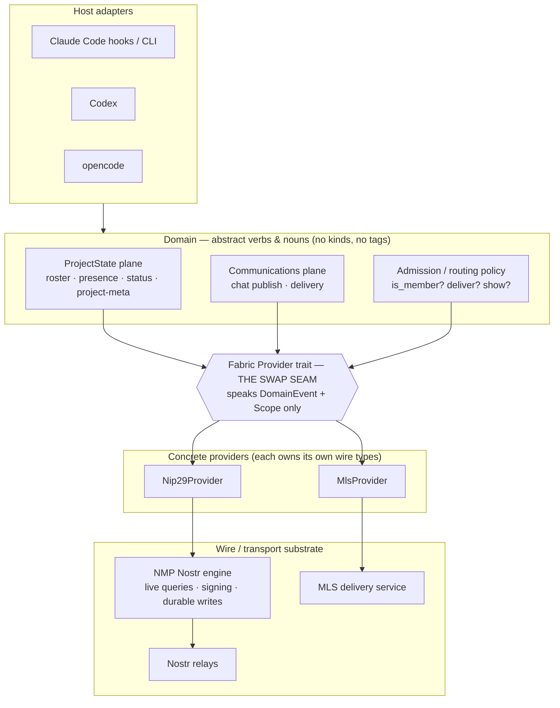
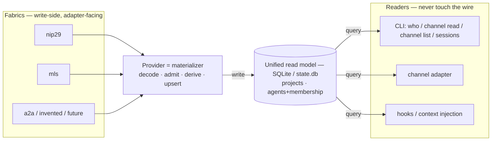
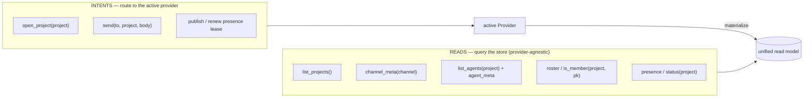
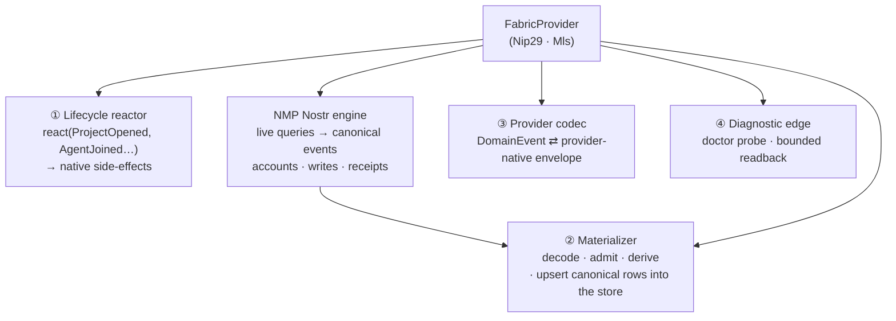
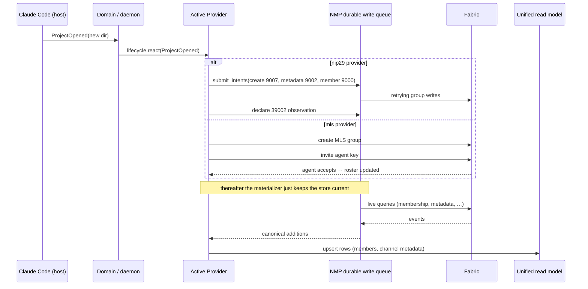
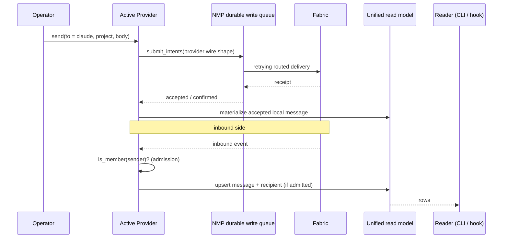

# mosaico — Fabric Architecture

> High-level architecture for the swap-seam: **all data is read from one unified
> local store; *how* it was hydrated is irrelevant to its use.** A **Fabric
> Provider** owns wire shape, admission, lifecycle effects, and canonical store
> projections. NMP is the sole relay I/O substrate and owns acquisition, signing,
> routing, receipts, retries, and the durable `submit_intents` queue. The direct
> `nostr` dependency supplies protocol values and builders only.

---

## 1. The core problem

The former `Codec` seam swapped *NIP layouts*, not *fabrics*. It trafficked in
Nostr wire types and fused three unrelated concerns into one trait:

- **wire mapping** (domain event ↔ envelope),
- **subscription model** (`filters → Vec<Filter>`, relay-REQ-shaped),
- **admission control** (NIP-29 group create / lock / put-user, bolted into the wire codec).

That fusion is why "a new codec" can only ever be another nostr codec, and why
NIP-29 — an *admission strategy* — leaks into an *event codec*. The fix is to cut the
seam along **concerns**, not along **kinds**.

Two observations drive the whole design:

1. **Membership is the hinge.** Whether to show a peer's presence or deliver a
   mention to an agent is one decision — *"is this pubkey a member?"* — but its
   **source** differs per fabric:

   | Fabric | "member" means | hydrated from |
   |--------|----------------|---------------|
   | nip29  | in the NIP-29 group | NMP observation of the live `39002` members list |
   | mls    | in the MLS group | MLS group roster after invite/accept |

   The **shape** is uniform (`is_member(project, pubkey)` + a change stream); the
   **source** is the provider's secret. Add a member from another machine → the
   NMP observation reflects it through the nip29 materializer; nothing above
   notices *how*.

   The **enforcement locus** also differs — and this is what forces admission to be
   a domain-side gate rather than something we delegate to the fabric:

   | Fabric | membership enforced | by whom |
   |--------|---------------------|---------|
   | nip29  | server-side — relay rejects non-member writes (closed group) | the relay |
   | mls    | cryptographically — non-members cannot decrypt | the crypto |

   **Principle:** the domain `is_member` gate is *always* consulted client-side;
   server/crypto enforcement is defense-in-depth, never a replacement. Even nip29 has inbound p-tag paths outside
   the group `#h` stream: NMP's aggregate `#p` live query receives them
   without a relay-side group-membership check. So the gate can never be skipped
   — which is exactly why it lives in the domain, above the provider seam.

2. **Lifecycle events have provider-specific side-effects.** "I run claude-code
   in a never-seen directory" is one domain event — `ProjectOpened` — that each
   provider *reacts* to differently:

   | Fabric | reaction to `ProjectOpened` |
   |--------|-----------------------------|
   | nip29  | create group `9007` → lock closed `9002` → put agent member `9000` |
   | mls    | create MLS group → invite agent key → await accept |

---

## 2. Layer cake

**Rule of the seam:** everything *above* `SEAM` is written once and never edited
to add a fabric. Everything *below* is a self-contained provider. The domain
speaks `DomainEvent`; live Nostr acquisition is expressed as NMP queries while
concrete providers decide how delivered envelopes materialize.

---

## 2a. The read model is the contract (the load-bearing principle)

**All consumption reads from one unified local store; *how* the data got there is
invisible to the reader.** NMP acquires and deduplicates Nostr events; a provider
decodes, admits, and **upserts canonical rows**.
Every consumer (CLI `who`/`channel read`/`channel list`, the
channel adapter, hooks, context injection) reads only the store. No reader ever
holds a `Provider`, names a kind, or touches the wire. This is CQRS, and it is
exactly why the daemon can solely own `state.db`: providers write, IPC clients
read.

This store already exists — `~/.mosaico/state.db`. Its `relay_*` tables are
materialized projections that can be rebuilt from the fabric; its local tables
(`sessions`, `session_channels`, `session_locators`, `session_signers`,
`handle_leases`, `inbox`, and `workspace_roots`) are non-rebuildable
daemon state. The schema is
stamped at open, so an incompatible or unstamped existing DB fails loudly instead
of being partially interpreted. The **single-writer materializer is the direct
fix for the multi-writer `state.db` corruption** already hit when ~16
per-session processes wrote concurrently: one daemon owns the writer, every
session/CLI is a read-only IPC client.

The `sessions` row also owns immutable runtime admission facts: observed
harness, selected bundle, transport kind, and endpoint provenance. Hook host
claims are stored separately for diagnostics. Delivery and liveness use those
facts plus an exact harness-keyed locator; mutable agent and bundle files are
never consulted to rediscover an alive runtime's transport.

**The canonical entities** (provider-agnostic — no kind, tag, or group-id in any
column a reader sees; a hidden `origin`/`wire_id` column may exist for the
*writer's* reconciliation only), mapped onto the real schema:

| Entity | Today's table(s) | Holds | Within |
|--------|------------------|-------|--------|
| project/channel metadata | `relay_channels` | slug/name, about text, parent channel | — |
| agents + identity | `relay_profiles`, `handle_leases`, `session_signers` | pubkey identity plus public-handle and signer bindings | — |
| membership | `relay_channel_members`, `relay_channel_member_sets` | which pubkeys belong to a channel | a project/channel |
| status | `relay_status`, `sessions` | who's online, plus per-session activity, title, and history | a project/channel |
| messages + recipients | `messages`, `message_recipients` | chat body, author pubkey, sync state, recipient pubkeys | a project/channel |

The current schema stores provider-shaped projections here; future read-model
work should wrap them rather than reintroduce parallel membership tables.

**The message row carries the author's pubkey as its return address.** Replies,
wait filters, and recipient edges use pubkeys; a selected local runtime is only
an ephemeral delivery locator and never part of message history. The `inbox`
table remains delivery state, not the message read model. A public handle comes
only from the authoritative handle-lease projection; it is never rebuilt from a
runtime id or inferred by parsing kind:0. When no current lease is known, the
pubkey/npub is the honest identity.

**Three consequences that make "how we hydrate is irrelevant" true:**

1. **Multiple providers populate one store.** Project A on nip29 and project B on
   MLS land in the *same* tables; a reader querying `list_projects()` cannot
   tell which fabric backed which row, and doesn't care.
2. **Every per-fabric difference lives behind the materialization seam.** The
   provenance axis, the enforcement-locus, the derived-vs-enumerated distinction
   (§3a) all describe *how the materializer fills a cell* — a reader sees a row or
   a `NULL`, never *why*. `Option`/divergence is the store's way of being honest
   when a fabric has no shared truth.
3. **Threads are a read-model entity even though no fabric has native threads.**
   *Deriving* thread structure (from reply-edges, `e`-tags, MLS message order) is
   a write-side materializer job; readers just `SELECT * FROM messages WHERE
   thread = ?`. This resolves the old "is Thread a wire noun?" question: no — it's
   a store noun the provider populates by whatever means its fabric allows.

So the swap-seam has two faces, and only one of them is ever in a reader's call
path:

- **Read face — the store schema.** Stable, provider-agnostic, the real contract.
- **Write face — the `Provider`.** Materializes inbound, publishes intents. Swap
  the fabric → swap the materializer; the schema and every reader are untouched.

---

## 3. The verbs — reads query the store, intents route to a provider

Verbs come in **two kinds**, and the distinction is *who is in the call path*:
**reads** are pure queries against the unified store (no provider, identical for
every fabric); **intents** are the only verbs that touch a provider (they publish
to the wire and reflect back into the store).

- **Reads** are exactly the user-facing list — *which projects exist, who's in
  them, who's online, and what they're doing.
  recipient of each.* All are `SELECT`s. None know the fabric.
- **Intents** are writes: open a project, send a message, renew a presence lease, or
  publish a kind:0 profile. The provider encodes the intent to its wire shape
  and submits it through NMP's durable `submit_intents` queue. NMP registers the
  exact account, freezes the per-write author, signs, routes, retries, and
  streams receipts; callers that need convergence wait for an ACK.
  The provider only then reflects accepted
  local writes into relay-derived read rows. Future optimistic UX must use an
  explicit pending-outbound state, never fabricated relay cache rows.
- **The admission gate lives on the write face, then becomes a read.** `is_member` is
  consulted *twice*: once at materialization time as an **admission predicate**
  (decode an inbound event → is the sender authorized → upsert or drop), and again
  at read time as a **query** over the membership rows (who may I show / route
  to). Both consult the same rows; neither touches the wire. One policy, one
  place — the store.

### 3a. Behind the materialization seam — the provenance axis

Everything in this subsection happens **on the write face, invisible to readers**.
It explains *how the materializer fills `relay_channels` and membership rows* —
the reader just sees the resulting row (or a `NULL`). Just as membership had an
*enforcement-locus* axis, project metadata has a **provenance / authority** axis —
*where the description comes from, and whether it is shared truth* — which differs
per fabric:

| Fabric | project *list* source | *description* source | authority / consistency |
|--------|----------------------|----------------------|-------------------------|
| nip29  | groups the agent belongs to (reverse of `39002`) / relay group enumeration | relay-authored `kind:39000` group metadata | **canonical & shared** — one source, every machine agrees |
| mls    | MLS groups in local state | group-context extension / metadata message | **member-authored**, cryptographically scoped to the group |

**Hydration mode is the acquisition boundary's business too** — *bounded vs.
standing*. nip29 asks the same NMP engine for a bounded `39000` projection or a
standing observation (the event is replaceable) and re-upserts on every change,
so a description edited on another machine propagates by simply updating the
store row — and the reader's next `SELECT` reflects it with zero changes
anywhere above the seam. The reader sees only the current row; "a new project
appeared on the fabric" is just an `INSERT` it will observe on its next query
(or via a store-level change-notify, never a second fabric subscription).

---

## 4. The Fabric Provider seam (SRP decomposition)

A `Provider` is **one cohesive object per fabric** that bundles four
single-responsibility capabilities. Splitting them keeps each concern testable
and prevents the current "codec also does admission" fusion.

| # | Capability | Responsibility | Must **not** |
|---|------------|----------------|--------------|
| ① | **Lifecycle** | Turn a domain lifecycle event into provider-native setup (create group, invite, or no-op). | Decide *when* a project opens (that's the host/daemon). |
| ② | **Materializer** | Consume NMP-delivered envelopes through one bounded, backpressured stream, decode via ③, then own admission and canonical upserts — membership, channel metadata, agents, status, and messages. The store is the read contract; this fills it. | Open relay work, drop canonical additions under load, or answer reads. |
| ③ | **Provider codec** | Pure, symmetric ser/de of the five+ `DomainEvent` nouns to the provider's native envelope. The current NIP-29 provider uses a Nostr-event codec. | Open subscriptions or manage groups. |
| ④ | **Diagnostic edge** | Run the explicit doctor connectivity probe and bounded diagnostic/resolution reads. | Publish runtime or profile state, sign product writes, own retries, or grow into a second write plane. |

The runtime only ever talks to one active provider interface. Swapping fabric =
swap the provider constructor (or a small enum of providers until a truly
object-safe async trait is needed). App-owned relay filters disappear from the
provider seam: NMP owns the live-query, signing, durable `submit_intents` queue
for all runtime/profile writes, receipts, retries, and connection lifecycle.

---

## 5. Walkthrough — "a brand-new project spins up"

Same domain trigger, three provider reactions. The host adapter emits
`ProjectOpened(dir)`; everything downstream is provider-private.

*(`STORE` = the unified read model; the host/CLI reads it directly, never `P`.)*

Then a human messages the agent — note the **send path** and the **inbound path**
both terminate at the store, and the reader is never in the loop:

The admission check (`is_member?`) is identical logic for all three fabrics; only
the source rows differ. When NMP delivers an updated `39002` row, the NIP-29
materializer updates membership and every reader sees the change through the
same store contract.
