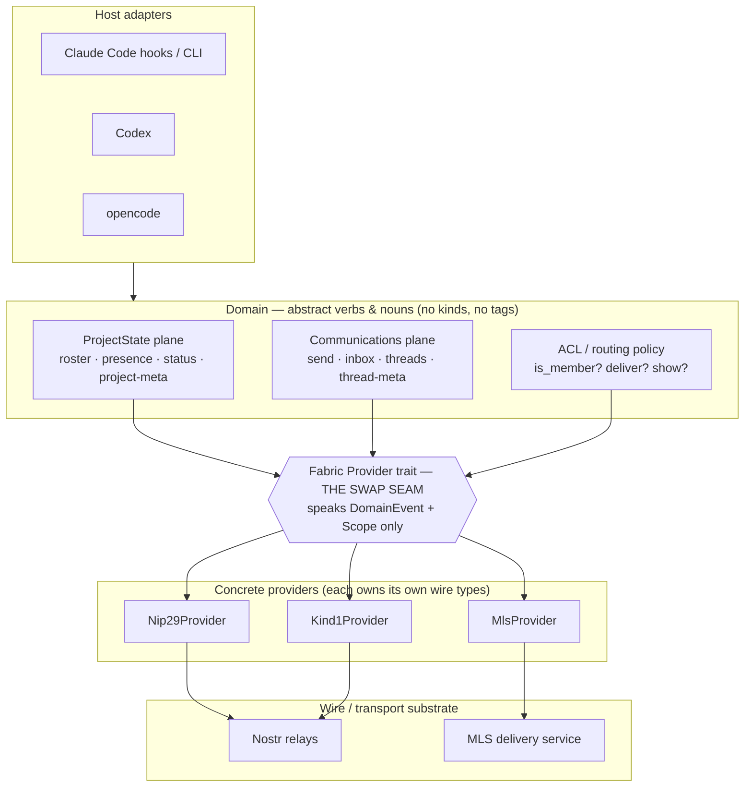
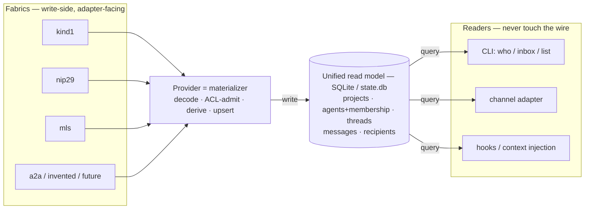
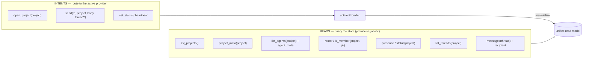
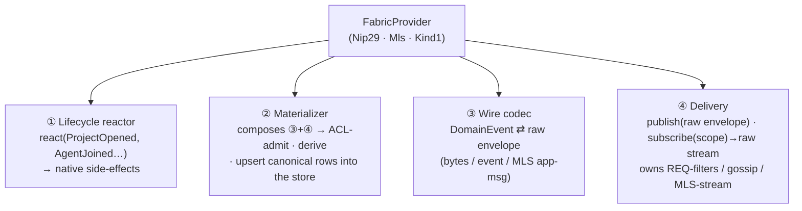
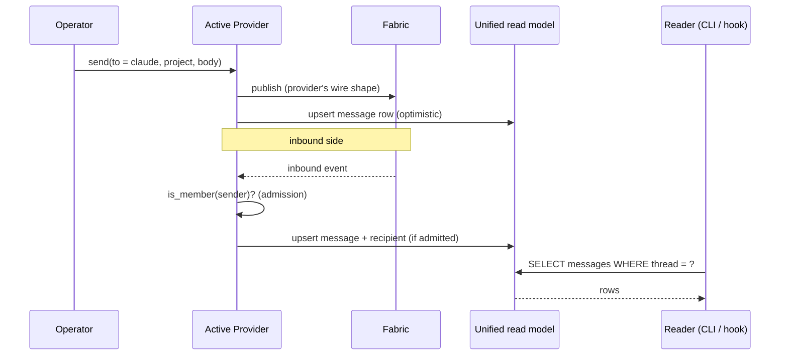

# tenex-edge — Fabric Architecture (proposal)

> High-level architecture for the swap-seam. The load-bearing idea: **all data is
> read from one unified local store; *how* it was hydrated is irrelevant to its
> use.** A **Fabric Provider** (kind1 / nip29 / mls / a2a / …) is a write-side
> materializer that owns all of how-and-who — wire shape, membership/ACL, lifecycle
> side-effects — and projects everything into canonical store rows. Readers query
> the store; nothing in a read path ever names a kind, a tag, a group, or a relay.

---

## 1. The core problem

The current `Codec` seam swaps *NIP layouts*, not *fabrics*. It traffics in
`nostr_sdk` types and fuses three unrelated concerns into one trait:

- **wire mapping** (domain event ↔ envelope),
- **subscription model** (`filters → Vec<Filter>`, relay-REQ-shaped),
- **access control** (NIP-29 group create / lock / put-user, bolted into `kind1`).

That fusion is why "a new codec" can only ever be another nostr codec, and why
NIP-29 — an *ACL strategy* — leaks into an *event codec*. The fix is to cut the
seam along **concerns**, not along **kinds**.

Two observations drive the whole design:

1. **Membership is the hinge.** Whether to show a peer's presence or deliver a
   mention to an agent is one decision — *"is this pubkey a member?"* — but its
   **source** differs per fabric:

   | Fabric | "member" means | hydrated from |
   |--------|----------------|---------------|
   | nip29  | in the NIP-29 group | live `39002` members list (kept subscribed) |
   | mls    | in the MLS group | MLS group roster after invite/accept |
   | kind1  | locally accepted | whitelist file of known/accepted pubkeys |

   The **shape** is uniform (`is_member(project, pubkey)` + a change stream); the
   **source** is the provider's secret. Add a member from another machine → the
   nip29 provider's live subscription reflects it; nothing above notices *how*.

   The **enforcement locus** also differs — and this is what forces the ACL to be
   a domain-side gate rather than something we delegate to the fabric:

   | Fabric | membership enforced | by whom |
   |--------|---------------------|---------|
   | nip29  | server-side — relay rejects non-member writes (closed group) | the relay |
   | mls    | cryptographically — non-members cannot decrypt | the crypto |
   | kind1  | client-side — we filter inbound against the local whitelist | us |

   **Principle:** the domain `is_member` gate is *always* consulted client-side;
   server/crypto enforcement is defense-in-depth, never a replacement. kind1 has
   no server enforcement at all, and even nip29 has un-scoped inbound paths (a
   direct p-tagged note reaches us via the `mentions_to` filter without the relay
   ever checking group membership). So the gate can never be skipped — which is
   exactly why it lives in the domain, above the provider seam.

2. **Lifecycle events have provider-specific side-effects.** "I run claude-code
   in a never-seen directory" is one domain event — `ProjectOpened` — that each
   provider *reacts* to differently:

   | Fabric | reaction to `ProjectOpened` |
   |--------|-----------------------------|
   | nip29  | create group `9007` → lock closed `9002` → put agent member `9000` |
   | mls    | create MLS group → invite agent key → await accept |
   | kind1  | **no-op** — a "group" is just a `t`/`h` tag on each event |

---

## 2. Layer cake



**Rule of the seam:** everything *above* `SEAM` is written once and never edited
to add a fabric. Everything *below* is a self-contained provider. The domain's
vocabulary is `DomainEvent` + `Scope` (today's `SubScope`) — the two types that
are already genuinely transport-agnostic.

---

## 2a. The read model is the contract (the load-bearing principle)

**All consumption reads from one unified local store; *how* the data got there is
invisible to the reader.** A provider is a **write-side materializer** — it
subscribes to its fabric, decodes, ACL-admits, and **upserts canonical rows**.
Every consumer (CLI `who`/`inbox`/`list`, the channel adapter, hooks, context
injection) reads only the store. No reader ever holds a `Provider`, names a kind,
or touches the wire. This is CQRS, and it is exactly why the daemon can solely own
`state.db`: providers write, IPC clients read.

This store already exists — `~/.tenex/edge/state.db`, with `profiles`,
`peer_sessions`, `inbox`, `agent_status`, `project_meta`, … The architecture
**extends** it (chiefly: add `threads`); it does not define a new one. And the
**single-writer materializer is the direct fix for the multi-writer `state.db`
corruption** already hit when ~16 per-session processes wrote concurrently: one
daemon owns the writer, every session/CLI is a read-only IPC client.



**The canonical entities** (provider-agnostic — no kind, tag, or group-id in any
column a reader sees; a hidden `origin`/`wire_id` column may exist for the
*writer's* reconciliation only), mapped onto the real schema:

| Entity | Today's table(s) | Holds | Within |
|--------|------------------|-------|--------|
| project + metadata | `project_meta` (`project`, `about`, `updated_at`) | slug, `about` text | — |
| agents + identity | `profiles` (`pubkey`,`slug`,`host`), `pending_agents` | identity card (slug, host, owners) | — |
| membership | *(implicit today: whitelist / `pending_agents`)* | which agents belong to a project | a project |
| presence / status | `peer_sessions`, `agent_status` | who's online, what they're doing | a project |
| messages | `inbox` (`from_pubkey`, `from_session`, `body`, `created_at`, …) | body, author, **sender session (the reply address)**, created_at | a thread |
| recipients | `inbox.target_session` (+ mention p-tag) | the addressee(s) | a thread / message |
| **threads** | **— (new)** | thread id, subject/meta | a project |

Most rows already exist; the materializer reframing mainly **promotes membership
to an explicit table** (today it's smeared across the whitelist and
`pending_agents`) and **adds `threads`** as the one genuinely new entity.

**The message row must carry its own return envelope.** A reader that surfaces an
inbound message has to know *who to reply to* — and that means the exact sender
*session*, not just the author pubkey: sibling sessions of one agent share a
pubkey, so the author key alone can't address a reply. So `inbox.from_session`
is a canonical column (materialized in kind1 from a `from-session` wire tag;
other fabrics carry it their own way, or leave it empty). The **reply handle** is
then a *read-side derivation* over store rows — the session id when it resolves to
a known session, else `slug@project` — exactly the same shape as the `is_member`
read-query: a pure `SELECT`-time computation, never a trip to the wire. When a
fabric can't supply a sender session the handle degrades honestly to agent-level,
the same `Option`/derived concession as everywhere else.

**Three consequences that make "how we hydrate is irrelevant" true:**

1. **Multiple providers populate one store.** Project A on nip29 and project B on
   kind1 land in the *same* tables; a reader querying `list_projects()` cannot
   tell which fabric backed which row, and doesn't care.
2. **Every per-fabric difference lives behind the materialization seam.** The
   provenance axis, the enforcement-locus, the derived-vs-enumerated distinction
   (§3a) all describe *how the materializer fills a cell* — a reader sees a row or
   a `NULL`, never *why*. `Option`/divergence is the store's way of being honest
   when a fabric has no shared truth.
3. **Threads are a read-model entity even though no fabric has native threads.**
   *Deriving* thread structure (from reply-edges, `e`-tags, MLS message order) is
   a write-side materializer job; readers just `SELECT * FROM messages WHERE
   thread = ?`. This resolves the old "is Thread a wire noun?" question: no — it's
   a store noun the provider populates by whatever means its fabric allows.

So the swap-seam has two faces, and only one of them is ever in a reader's call
path:

- **Read face — the store schema.** Stable, provider-agnostic, the real contract.
- **Write face — the `Provider`.** Materializes inbound, publishes intents. Swap
  the fabric → swap the materializer; the schema and every reader are untouched.

---

## 3. The verbs — reads query the store, intents route to a provider

Verbs come in **two kinds**, and the distinction is *who is in the call path*:
**reads** are pure queries against the unified store (no provider, identical for
every fabric); **intents** are the only verbs that touch a provider (they publish
to the wire and reflect back into the store).



- **Reads** are exactly the user-facing list — *which projects exist, who's in
  them, who's online, what they're doing, which threads, which messages, and the
  recipient of each.* All are `SELECT`s. None know the fabric.
- **Intents** are writes: open a project, send a message, beat a heartbeat. The
  provider encodes the intent to its wire shape and (optimistically, or on echo)
  the materializer reflects it back as a row.
- **The ACL gate lives on the write face, then becomes a read.** `is_member` is
  consulted *twice*: once at materialization time as an **admission predicate**
  (decode an inbound event → is the sender authorized → upsert or drop), and again
  at read time as a **query** over the membership rows (who may I show / route
  to). Both consult the same rows; neither touches the wire. One policy, one
  place — the store.

### 3a. Behind the materialization seam — the provenance axis

Everything in this subsection happens **on the write face, invisible to readers**.
It explains *how the materializer fills `project_meta` and `membership`* — the
reader just sees the resulting row (or a `NULL`). Just as membership had an
*enforcement-locus* axis, project metadata has a **provenance / authority** axis —
*where the description comes from, and whether it is shared truth* — which differs
per fabric:

| Fabric | project *list* source | *description* source | authority / consistency |
|--------|----------------------|----------------------|-------------------------|
| nip29  | groups the agent belongs to (reverse of `39002`) / relay group enumeration | relay-authored `kind:39000` group metadata | **canonical & shared** — one source, every machine agrees |
| mls    | MLS groups in local state | group-context extension / metadata message | **member-authored**, cryptographically scoped to the group |
| kind1  | *derived* — observed `h`/`t` tags + local list of dirs run in | **none native** → local descriptor file or a self-published note | **client-local** — two machines may disagree; eventually-divergent |

The sharp edge is **kind1**: a "group" is just a tag, so there is no native
carrier for a description and no authoritative project registry. Two consequences
the domain must absorb:

- **The list is *derived*, not *enumerated*.** For kind1, `list_projects()` is
  reconstructed from observed events (which `h`/`t` tags have we seen?) plus a
  local record of directories opened — never a server-side directory listing.
- **Description is `Option`, and may be local-only.** The domain types
  `description: Option<String>` and tolerate per-machine divergence. This is the
  exact analogue of kind1's client-side membership enforcement: not a flaw in the
  abstraction, but the abstraction faithfully surfacing that the fabric has no
  shared truth here.

**Hydration mode is the materializer's business too** — *pull vs. live*. nip29/mls
can one-shot **fetch** the `39000` metadata *or* **subscribe** to it (it's
replaceable) and re-upsert on every change, so a description edited on another
machine propagates by simply updating the store row — and the reader's next
`SELECT` reflects it with zero changes anywhere above the seam. kind1 uses whatever
local mechanism applies (file watch, or re-derive from the event stream). Either
way the reader sees only the current row; "a new project appeared on the fabric"
is just an `INSERT` it will observe on its next query (or via a store-level
change-notify, never a fabric subscription).

---

## 4. The Fabric Provider seam (SRP decomposition)

A `Provider` is **one cohesive object per fabric** that bundles four
single-responsibility capabilities. Splitting them keeps each concern testable
and prevents the current "codec also does ACL" fusion.



| # | Capability | Responsibility | Must **not** |
|---|------------|----------------|--------------|
| ① | **Lifecycle** | Turn a domain lifecycle event into provider-native setup (create group, invite, or no-op). | Decide *when* a project opens (that's the host/daemon). |
| ② | **Materializer** | **Composes ③ and ④:** consume ④'s inbound stream, decode via ③, then own *only* admission (ACL), derivation (e.g. thread structure), and upsert of canonical rows — membership, project list & metadata, agents, threads, messages, recipients. The store is the read contract; this fills it. | Subscribe or decode *itself* (that's ④ and ③), or answer reads (readers query the store directly; the materializer never sits in a read path). |
| ③ | **Wire codec** | Pure, symmetric ser/de of the five+ `DomainEvent` nouns to its envelope. | Open subscriptions or manage groups. |
| ④ | **Delivery** | Connect/auth, publish raw envelopes, and stream raw inbound envelopes for a `Scope`. Owns whatever fetch model the fabric uses. | Decode, derive, apply ACL, or know domain meaning. |

The runtime only ever talks to one active provider interface. Swapping fabric =
swap the provider constructor (or a small enum of providers until a truly
object-safe async trait is needed). The `filters`-shaped subscription model
disappears from the public seam — it becomes a private detail of the nostr
delivery impl, so a push/gossip/MLS delivery model is now expressible.

---

## 5. Walkthrough — "a brand-new project spins up"

Same domain trigger, three provider reactions. The host adapter emits
`ProjectOpened(dir)`; everything downstream is provider-private.

```mermaid
sequenceDiagram
    participant CC as Claude Code (host)
    participant DOM as Domain / daemon
    participant P as Active Provider
    participant FAB as Fabric
    participant STORE as Unified read model

    CC->>DOM: ProjectOpened(new dir)
    DOM->>P: lifecycle.react(ProjectOpened)

    alt nip29 provider
        P->>FAB: create group 9007 (h = dir slug)
        P->>FAB: edit-metadata 9002 (closed + public)
        P->>FAB: put-user 9000 (agent = member)
        %% subscribe 39002 members keeps the ACL live
        P->>FAB: subscribe 39002 members
    else mls provider
        P->>FAB: create MLS group
        P->>FAB: invite agent key
        FAB-->>P: agent accepts → roster updated
    else kind1 provider
        P-->>P: no-op (group == t/h tag; nothing to create)
    end

    Note over P,FAB: thereafter the materializer just keeps the store current
    P->>FAB: subscribe (membership, metadata, …)
    FAB-->>P: events
    P->>STORE: upsert rows (members, project_meta)
```
*(`STORE` = the unified read model; the host/CLI reads it directly, never `P`.)*

Then a human messages the agent — note the **send path** and the **inbound path**
both terminate at the store, and the reader is never in the loop:



The admission check (`is_member?`) is identical logic for all three fabrics; only
the **source rows** it reads were filled differently. Add a pubkey as a member
from another computer → the nip29 materializer's live `39002` subscription upserts
the `membership` table → the next admission check and the next reader `SELECT`
both reflect it, with zero changes above the store.

---

## 6. Implementation plan

The refactor should be done in behavior-preserving slices. The first provider is
not a new fabric; it is today's kind1 + NIP-29 behavior pulled behind the new
seams. Do not start by deleting the current `Codec`/`Transport`/`Store` paths.
Add the new read model, dual-write where necessary, cut readers over, then delete
legacy access once tests prove the projections are authoritative.

### Guardrails

- Existing host adapters stay thin and keep their current CLI/RPC surface:
  `who`, `inbox`, `send-message`, `turn-start`, `turn-check`, `tail`,
  `project-list`, and `project-edit`.
- The daemon remains the only SQLite writer. New provider code must not open its
  own `rusqlite::Connection`.
- Existing behavior is the regression oracle: same-machine local delivery,
  targeted session mentions, NIP-29 group create/lock/add, project metadata cache,
  pending-agent ACL flow, and startup mention fetch must still work.
- Keep legacy tables during cutover. The plan below adds canonical tables and
  backfills/dual-writes before any old table is removed.

### Phase 0 - freeze current behavior

Before moving code, add tests around the behavior that will be extracted.

Files:

- `tests/daemon_integration.rs`
- `tests/daemon_mechanics.rs`
- `tests/e2e_transport.rs`
- `src/state.rs` unit tests
- `src/runtime.rs` unit tests

Coverage to pin:

1. `send-message` to a hosted sibling session inserts one inbox row using the
   signed event id, and relay echo/fetch does not duplicate it.
2. A targeted session mention reaches only the target session; an untargeted
   mention reaches alive sessions for that recipient agent/project only.
3. `handle_incoming` applies 39000 metadata and 39002 membership snapshots
   idempotently.
4. `who` and turn-start context are rendered from store state only.
5. Unknown-but-owner-related profiles enter `pending_agents`; allowed profiles
   enter `profiles`; blocked profiles are ignored.
6. `fetch_mentions_into_inbox` catches stored kind:1 mentions after startup.

Done when: these tests fail if `handle_incoming`, `route_mention_into`, or
`resolve_recipient` regress during extraction.

### Phase 1 - add canonical read-model schema

Extend `src/state.rs` without changing readers yet.

Add durable ids and origins:

- `projects(project_id TEXT PRIMARY KEY, display_slug TEXT NOT NULL, about TEXT,
  created_at INTEGER NOT NULL, updated_at INTEGER NOT NULL)`
- `project_origins(project_id TEXT NOT NULL, fabric TEXT NOT NULL,
  provider_instance TEXT NOT NULL, native_project_key TEXT NOT NULL,
  UNIQUE(fabric, provider_instance, native_project_key))`
- `threads(thread_id TEXT PRIMARY KEY, project_id TEXT NOT NULL, subject TEXT,
  created_at INTEGER NOT NULL, updated_at INTEGER NOT NULL, archived_at INTEGER)`
- `thread_origins(thread_id TEXT NOT NULL, fabric TEXT NOT NULL,
  provider_instance TEXT NOT NULL, native_thread_key TEXT NOT NULL,
  UNIQUE(fabric, provider_instance, native_thread_key))`

Add canonical communication rows:

- `messages(message_id TEXT PRIMARY KEY, thread_id TEXT NOT NULL,
  author_pubkey TEXT NOT NULL, author_session TEXT, body TEXT NOT NULL,
  created_at INTEGER NOT NULL, direction TEXT NOT NULL, sync_state TEXT NOT NULL,
  native_event_id TEXT, error TEXT)`
  - `author_session` is the **return envelope**: the sender's session id, so a
    reply can target the exact sibling session that wrote the message (sessions of
    one agent share `author_pubkey`, so the pubkey alone can't address a reply).
    Carried today on `inbox.from_session`; materialized in kind1 from a
    `from-session` wire tag, `NULL` when a fabric can't supply it (reply then
    degrades to agent-level). The reply *handle* stays a read-side derivation, not
    a stored column.
- `message_recipients(message_id TEXT NOT NULL, recipient_pubkey TEXT NOT NULL,
  target_session TEXT, delivered_at INTEGER, PRIMARY KEY(message_id,
  recipient_pubkey, target_session))`
- `inbound_quarantine(native_event_id TEXT PRIMARY KEY, project_id TEXT, reason
  TEXT NOT NULL, raw_envelope TEXT NOT NULL, created_at INTEGER NOT NULL)`

Normalize membership:

- `membership(project_id TEXT NOT NULL, pubkey TEXT NOT NULL, role TEXT NOT NULL,
  admitted_at INTEGER NOT NULL, revoked_at INTEGER, source TEXT NOT NULL,
  updated_at INTEGER NOT NULL, PRIMARY KEY(project_id, pubkey))`

Accessors to add first:

- `ensure_project_origin(fabric, provider_instance, native_project_key, display_slug) -> project_id`
- `project_id_for_origin(fabric, provider_instance, native_project_key) -> Option<String>`
- `ensure_thread_origin(project_id, fabric, provider_instance, native_thread_key) -> thread_id`
- `record_message(...) -> message_id`
- `mark_message_sync_state(message_id, sync_state, error)`
- `add_message_recipient(message_id, recipient_pubkey, target_session)`
- `admit_member(project_id, pubkey, role, source, ts)`
- `revoke_member(project_id, pubkey, ts)`
- `is_member_at(project_id, pubkey, ts) -> MembershipDecision`
- `quarantine_inbound(native_event_id, project_id, reason, raw_envelope)`
- `replay_quarantine(project_id/pubkey filter) -> Vec<RawEnvelopeRef>`

Backfill rules:

- For every existing `project_meta.project`, `sessions.project`,
  `peer_sessions.project`, and `group_members.project`, create a project with
  origin `(fabric='kind1-nip29', provider_instance=<relay set hash>,
  native_project_key=<slug>)`.
- Mirror existing `group_members` into `membership` with `source='nip29-39002'`.
- Do not migrate historical `inbox` rows into `messages` yet unless tests need
  it; first dual-write new inbound/outbound mentions. When dual-writing, copy
  `inbox.from_session → messages.author_session` so the return envelope is never
  dropped in the cutover.

Done when: the new tables can be created on an existing `state.db`, backfilled
idempotently, and queried without changing CLI output.

### Phase 2 - split StoreReader and StoreWriter

Keep the concrete `Store` type, but narrow how callers use it.

Add read-facing methods for host/RPC code:

- `list_projects_read_model()`
- `project_meta_read_model(project_id or slug)`
- `list_agents_read_model(project)`
- `list_presence_read_model(project)`
- `list_status_read_model(project)`
- `list_threads(project)`
- `messages_for_thread(thread_id)`
- `undelivered_messages_for_session(session_id)`

Add write-facing methods for provider/materializer code:

- `materialize_profile(...)`
- `materialize_presence(...)`
- `materialize_status(...)`
- `materialize_membership_snapshot(...)`
- `materialize_inbound_message(...)`
- `materialize_outbound_message(...)`
- `mark_outbound_accepted/echoed/failed(...)`

Then move read assembly behind those methods:

- `rpc_who` stops depending on legacy `profiles`/`peer_sessions` layout directly.
- `assemble_turn_start_context` and `assemble_turn_check_context` read through the
  read model.
- `rpc_project_list` prefers local `projects` rows, using relay fetch only as a
  materialization refresh.

Compatibility rule: if a read-model row is absent during rollout, readers may
fall back to legacy tables. That fallback must be temporary and covered by a
TODO naming the phase that removes it.

Done when: every reader has a read-model method to call, even if some methods
still bridge to legacy tables internally.

### Phase 3 - extract raw Nostr delivery from the codec

Today `Codec::filters` mixes wire shape and subscription mechanics. Split it
without changing the daemon subscription behavior.

New module shape:

- `src/fabric/mod.rs`
- `src/fabric/nostr_delivery.rs`
- `src/fabric/kind1/wire.rs`
- `src/fabric/kind1/materializer.rs`
- `src/fabric/nip29/lifecycle.rs`

Types:

```rust
pub enum RawEnvelope {
    Nostr(nostr_sdk::Event),
}

pub struct Scope {
    pub authors: Vec<String>,
    pub project: Option<String>,
    pub mentions_to: Option<String>,
    pub owners: Vec<String>,
    pub thread: Option<String>,
}

pub trait Delivery {
    fn name(&self) -> &'static str;
    async fn publish(&self, envelope: RawOutboundEnvelope) -> Result<NativeId>;
    async fn publish_checked(&self, envelope: RawOutboundEnvelope) -> Result<NativeId>;
    async fn subscribe(&self, scope: Scope) -> Result<()>;
    async fn fetch(&self, scope: FetchScope) -> Result<Vec<RawEnvelope>>;
    fn notifications(&self) -> RawEnvelopeStream;
}

pub trait WireCodec {
    fn encode(&self, event: &DomainEvent) -> Result<RawOutboundEnvelope>;
    fn decode(&self, envelope: &RawEnvelope) -> Option<DecodedEvent>;
}
```

Implementation steps:

1. Move the filter construction from `Kind1Codec::filters` into
   `NostrDelivery::subscribe(scope)`.
2. Keep `Transport` as the private implementation detail of `NostrDelivery`.
3. Keep `Kind1Codec::encode/decode` mostly intact, but rename conceptually to
   `Kind1WireCodec`.
4. Leave the old `Codec` trait as a compatibility shim until `DaemonState` no
   longer stores `codec: Kind1Codec`.

Done when: `resubscribe` no longer calls `state.codec.filters(&scope)`; it asks
delivery to subscribe to `Scope`, while decode remains in the wire codec.

### Phase 4 - extract the materializer

Move `handle_incoming` out of `src/daemon/server.rs` into a materializer owned by
the provider.

Materializer input:

- raw envelope
- hosted local pubkeys
- current time
- constrained `StoreWriter`

Materializer output:

- optional rendered/tail domain event
- mention wake signal
- quarantine/replay request
- sync-state reconciliation event

Extraction order:

1. Move 39000 handling to `Nip29Materializer::materialize_group_metadata`.
2. Move 39002 handling to `Nip29Materializer::materialize_membership_snapshot`.
3. Move profile/pending-agent logic to `Kind1Materializer::materialize_profile`.
4. Move presence/status upserts to `Kind1Materializer`.
5. Move mention routing from `runtime::route_mention_into` into
   `materialize_inbound_message`, while leaving a thin compatibility wrapper for
   existing tests.
6. Move startup mention fetch through the same materializer path; it should not
   have a separate decode/route implementation.

ACL behavior:

- Nostr admission uses `event.pubkey` as the actor identity. Ignore claimed
  `agent` tags for authorization.
- If membership for the project is known and sender is not admitted, quarantine
  or drop according to local policy.
- If membership is not hydrated yet, quarantine. Replay on 39002 snapshot,
  whitelist allow, or project-origin creation.
- Presence/status/current roster use current membership; admitted messages remain
  historical after revocation.

Done when: `server.rs::handle_incoming` is a small dispatch to
`provider.materialize(raw_envelope)`, and every inbound path shares the same
materialization code.

### Phase 5 - introduce FabricProvider

Once delivery, wire codec, materializer, and lifecycle have concrete homes, add
the top-level provider.

Provider API shape (pseudo-Rust; implement first with a concrete
`Kind1Nip29Provider`, or use boxed futures / `async_trait` before storing it
behind `dyn`):

```rust
pub trait FabricProvider {
    fn name(&self) -> &'static str;
    async fn open_project(&self, project_slug: &str, agent_pubkey: &str) -> Result<()>;
    async fn send(&self, intent: SendIntent) -> Result<OutboundReceipt>;
    async fn set_status(&self, status: StatusIntent) -> Result<OutboundReceipt>;
    async fn subscribe_project(&self, project_id: &str) -> Result<()>;
    async fn catch_up_mentions(&self, session: &SessionRecord) -> Result<usize>;
    fn materialize(&self, envelope: RawEnvelope) -> Result<MaterializationOutcome>;
}
```

The first implementation is `Kind1Nip29Provider`:

- Lifecycle wraps the current `ensure_group_and_membership`.
- Delivery wraps `Transport`.
- Wire codec wraps current kind1 encode/decode.
- Materializer owns metadata, membership, profile, presence, status, messages,
  recipients, quarantine, and tail output.

Daemon changes:

- `DaemonState` holds one active provider (`Kind1Nip29Provider` at first; a
  provider enum or object-safe boxed trait later) instead of exposing separate
  `transport + codec` fields to RPC code.
- `spawn_demux` receives raw envelopes from provider delivery and calls
  `provider.materialize`.
- `rpc_session_start` calls `provider.open_project(...)` before spawning the
  engine.
- `ensure_subscription` becomes `provider.subscribe_project(project_id)`.
- `fetch_mentions_into_inbox` becomes `provider.catch_up_mentions(&rec)`.

Done when: daemon RPC behavior is unchanged, but fabric-specific code is no
longer in `server.rs` except provider construction.

### Phase 6 - move outbound writes to read-model messages

Refactor `rpc_send_message` around an explicit send intent.

Steps:

1. Resolve sender session and recipient using read-model accessors.
2. Build `SendIntent { from_agent, from_session, to_pubkey, project_id, body,
   target_session, thread_id }` — `from_session` becomes the stored message's
   `author_session` (the return envelope), so inbound replies can address it.
3. Provider signs first, returning the native event id.
4. Store inserts/updates:
   - `messages.sync_state='published'` when publish returns without checked OK.
   - `messages.sync_state='accepted'` when checked publish confirms relay OK.
   - `messages.sync_state='failed'` with `error` on rejection/timeout.
5. Same-daemon hosted recipients are delivered by inserting message recipient
   rows using the final native id. Echo/fetch is idempotent through
   `native_event_id` + recipient uniqueness.
6. `inbox` becomes either:
   - a compatibility projection over `messages` + `message_recipients`, or
   - a legacy table dual-written until turn injection is cut over.

Done when: `inbox`, `wait-for-mention`, and turn-start context can render from
canonical message rows without losing the old delivered/seen semantics.

### Phase 7 - thread materialization and APIs

Add thread-aware read/write behavior after messages are canonical.

Steps:

1. For kind1/nip29 inbound messages:
   - use NIP-10 root `e` tag as `native_thread_key`;
   - if no root exists, use the event id as root;
   - attach `(fabric, provider_instance, native_thread_key)` to
     `thread_origins`.
2. For outbound root messages:
   - create local `thread_id`;
   - sign event;
   - attach event id as native thread key.
3. For replies:
   - require either `thread_id` or enough native reply context to resolve one;
   - encode root/reply tags in the provider.
4. Add CLI/RPC reads:
   - `list_threads(project)`
   - `messages(thread)`
   - `thread_meta(thread)`
5. Keep participant hash as a temporary helper only when importing old messages
   that lack reply/root structure; never store it as the durable origin.

Done when: the Communications plane has real thread/message reads and the old
per-session inbox is just one delivery view over the same messages.

### Phase 8 - remove legacy coupling

Only after the cutover tests pass:

- Remove `Codec::filters` from the public seam.
- Move NIP-29 group builders out of `src/codec/kind1.rs`.
- Delete direct fabric handling from `daemon/server.rs`.
- Remove direct reader dependence on `profiles`, `peer_sessions`, `inbox`, and
  `project_meta` table shape; keep tables only if they are compatibility views or
  deliberately retained storage.
- Replace `SubScope` with `Scope` everywhere.
- Update docs/wiki pages after the source doc is correct.

Done when: adding an MLS/A2A provider means implementing provider capabilities,
not editing reader code or daemon routing logic.

### Validation ladder

Run this after each phase, broadening only when the phase touches more surface:

1. `cargo test`
2. `cargo test --test daemon_mechanics`
3. `cargo test --test daemon_integration`
4. `cargo test --test e2e_transport -- --ignored --nocapture` when relay behavior
   changes
5. `cargo test --test nip29_probe -- --ignored --nocapture` when NIP-29 lifecycle
   or membership materialization changes
6. Manual smoke:
   - start two sessions in the same project;
   - `tenex-edge who`;
   - send by session prefix;
   - drain `tenex-edge inbox`;
   - verify no duplicate after a fetch/turn-start;
   - edit project metadata and confirm local read-model update.

---

## 7. Remaining decisions

- **Identity binding** (agent keypair ↔ fabric identity) is assumed shared, but
  MLS adds a key-package / accept handshake with no nostr analogue. Is that a
  fifth provider capability, or part of Lifecycle?
- **Multi-fabric at once** — can a daemon run nip29 *and* kind1 providers
  concurrently (one project per fabric), and are rosters ever merged across
  providers or always partitioned by `project_id` / `project_origins`?
- **Store schema versioning** — once the read model is the contract, migrations
  need an explicit compatibility policy for older daemons and clients.
