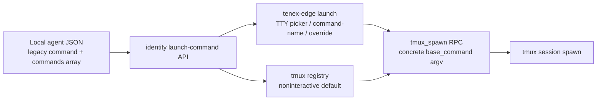

# Launch Named Command Picker for Issue 258

## Summary

Plan an additive launch-command model for tenex-edge agents: named command choices in local agent JSON, CLI-side selection for interactive launches, conservative cross-agent suggestions when a command is missing, and daemon-safe fallback behavior for noninteractive spawns.

## Boundaries

## Detailed Plan

## Scope

Implement issue #258 for `tenex-edge launch <agent>` and the local agent config model. Do not close the issue from the planning PR. The implementation PR should close it after code, tests, and durable docs land.

## Data Model

Add a stored named-command shape with `name: String` and `argv: Vec<String>`. Store it in a new `commands` array on agent JSON. Keep existing singular `command` deserialization as a legacy fallback only. Effective command order should be: nonempty `commands`, then nonempty legacy `command` as a single `default` choice, then built-in harness default when the slug matches `SPAWN_DEFS`.

New writes should avoid duplicating `command` and `commands`. When modifying launch commands, write canonical `commands` and drop legacy `command` from that file. Existing files that are only read do not need a migration.

Because `src/identity.rs` is already above the soft line target, put launch-command normalization and suggestion helpers in a cohesive identity submodule or another domain-owned submodule with `pub(super)` or `pub(crate)` visibility.

## CLI Behavior

Keep `-c/--command` as the current full command override. Add a new noninteractive selector, preferably `--command-name <name>`, because `--command` is already taken. If the selector is present, resolve the named choice or fail with the available names. If multiple choices exist and no selector or override exists, require a TTY and show a `dialoguer` or `inquire` picker. If stdin/stdout is not a TTY, fail with a concrete message telling the caller to pass `--command-name` or `-c`.

If zero configured choices exist and no built-in fallback applies, prompt on TTY. Suggestions come from other agent files first. Include both canonical `commands` and legacy `command` entries. Adapt suggestions with two safe rules: replace a literal `{slug}` placeholder with the target slug, and replace exact source-slug argv tokens or path filename stems equal to the source slug. Do not perform broad substring replacement. If no local suggestions exist, show built-in harness defaults. Include a custom-command entry that shell-splits user input with the existing `shlex` dependency. Persist the selected or custom command atomically as a named command before spawning.

## Daemon And Tmux Boundaries

Do not make `tmux_spawn`, `spawn_agent`, or `resolve_spawn_entry` interactive. The CLI launch command should pass the selected argv through `base_command`. The existing daemon fallback remains deterministic for TUI or background callers: choose the first canonical command, legacy command, or built-in default. `spawnable_agents()` can display the default command plus an indication when multiple choices exist, but it should not require a prompt.

Resume should continue using the deterministic default command, because a prior session resume must not stop for a picker. A future enhancement can persist the command used by a session if exact resume-command parity becomes necessary.

## Validation

Add unit tests for canonical command parsing, legacy fallback, command precedence, empty argv filtering or errors, unique-name handling, and canonical writes. Add pure helper tests for suggestion adaptation, including placeholder replacement, exact token replacement, path-stem replacement, and no broad substring mutation. Add CLI parse tests for `--command-name` alongside the existing `-c/--command` override. Add registry tests showing deterministic default resolution for multi-command configs and existing legacy configs.

Run `cargo fmt --check`, targeted tests for identity/tmux CLI modules, and `cargo test --lib` if the change touches shared identity or spawn behavior. Avoid formatting churn outside touched files.

## Docs

After implementation, update the authoritative launch docs in `docs/wiki/guides/tenex-edge-launch.md` and the CLI surface docs in `docs/wiki/guides/tenex-edge-cli-commands.md`. If the config schema details become durable user-facing knowledge, add them to the existing agent identity or config guide instead of creating a new planning file.

## Rollout And Rollback

Rollout is local and backward compatible: existing agent files with `command` still launch. Rollback is also local: older binaries continue to read legacy `command`; files converted to `commands` may need manual fallback only if a user intentionally returns to an older binary. Minimize that by documenting the schema change and avoiding automatic migration of untouched files.

## Risks And Open Questions

The largest UX risk is confusion between the existing full command override and the new named selector; using `--command-name` avoids breaking the current `--command` contract. The largest correctness risk is unsafe suggestion adaptation; keep it conservative and covered by tests. The plan intentionally does not add last-used command memory, because that introduces hidden state and is not necessary for the requested picker.

## Rule And ADR Check

- No ADR files exist in this repository; governing constraints are AGENTS.md plus durable architecture/product docs.
- The GitHub issue remains the backlog source of truth; the generated docs/plans artifact is a temporary planning PR artifact and must be retired or collapsed after implementation.
- The implementation should respect the 300-line soft and 500-line hard file-size rule: identity.rs is already 382 lines, so added launch-command parsing or suggestion logic should move into a cohesive submodule with narrow visibility.
- The product doctrine says agent identity persists across hosts; this plan keeps launch commands as local per-agent configuration attached to the existing local agent identity file, not to transient sessions.
- The daemon RPC stays noninteractive and receives concrete argv, preserving existing ownership boundaries between CLI UX, daemon provisioning, and tmux spawning.

## Possible Rule Or ADR Loosening

- No permanent repository rule needs loosening.
- The only rule tension is the planning PR artifact itself; it is acceptable only as a temporary publication mechanism for this planning workflow, not as durable backlog state.

## Possible Rule Tightening

- Consider documenting that daemon RPC handlers and background spawn paths must never prompt on stdin; all interactive selection belongs in explicit CLI/TUI layers.
- Consider documenting local config schema migrations: legacy fields may be read as fallback, but new writes should have one canonical representation.

## Alternatives Considered

- Array-of-tuples schema: compact, but weaker for validation and future fields than object entries with name and argv.
- Prompt inside resolve_spawn_entry or the daemon: fewer call sites, but unsafe for RPC, TUI, and background spawn callers because it can hang noninteractive paths.
- Always pick the first configured command silently: simplest, but fails the requested launch-time choice behavior and hides privileged command variants.
- Broad string substitution for cross-agent suggestions: convenient, but too likely to mutate unrelated paths or flags; explicit placeholders plus exact token/stem replacement is safer.

## Certainty

84 percent.

## Decision

ready

## Hosted Artifacts

- Plan page: https://pablof7z.github.io/tenex-edge/plans/launch-named-command-picker/

- TTS audio: https://blossom.primal.net/bdcbcd9a4aa9e23ef945d77c7ccad3c33bef5ba3ba65f0fb010faad8ec92f404.mp3
