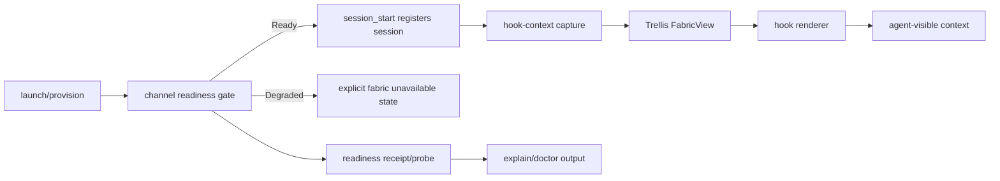

# Truthful Channel Awareness And Provisioning Diagnostics

## Summary

Plan fixes the path where launch/session hooks can imply a project channel and roster even though NIP-29 provisioning never produced relay-backed channel state.

## Boundaries

## Detailed Plan

## Evidence

Issues: #259, #260, #261, and #262. Local evidence shows `tenex-edge channels list` returning no channels. The latest Codex session-start hook failed with: `relay did not provision channel \"tenex-edge\" ... its kind:39000 never materialized`. Follow-on hooks then report unknown session or degraded fabric. `tenex-edge doctor` independently reports relay publish failure: `blocked: group ... doesn't exist`. The state database has zero `relay_channels` and zero channel members, while session/session_channels rows can still contain the desired scope string.

## Implementation Slices

1. Launch and session readiness. Keep `session_start` fail-closed after `ensure_start_channel_ready` fails. Change launch preflight so a degraded `ensure_channel_ready` result is not treated as fabric-ready. Either fail explicit channel launch, or open a local-only pane with an explicit degraded marker such as a separate env field and no confirmed channel. The hook should not infer channel membership from `TENEX_EDGE_CHANNEL` when readiness failed. Also move session row/channel join after readiness or ensure abort cleanup removes pre-readiness `session_channels` joins.

2. Hook-context capture and render truthfulness. In `fabric_context::build` and `fabric_context::capture::read`, stop including the requested scope as a renderable channel unless `Store::get_channel(scope)` confirms a materialized `relay_channels` row, or unless a deliberately separate degraded/missing-channel row is being rendered. Avoid `channel_summary` falling back from missing metadata to the raw channel id for `<channel name>`. Add a warning row for missing active channel metadata.

3. Roster semantics. Split local invitable agents from channel presence. The existing `agents(edge_home, ...)` path reads local config via identity inventory; it should not be interpreted as a channel roster. Rename or restructure the rendered block, or move it out of the project/channel presence area. Confirmed channel membership should remain sourced from `relay_channel_members` and rendered under `<members>` or presence. If the channel is missing, membership should be empty or unavailable, not synthesized from local agents or self.

4. Trellis and diagnostics. Do not make Trellis sign or publish relay effects. Instead, feed host-observed readiness facts into diagnostics: channel id, requested name, parent, expected member, gate result, publish rejection, materialization attempts, and resulting missing metadata. Extend `probe why`/`explain` with `session_start:<id>` and channel readiness handles so operators can answer why a channel was absent. The hook-context Trellis graph should continue to explain the rendered snapshot and should show `channel-meta` or channel provenance as the cause when missing metadata changes output.

## Validation

Add unit tests for missing-scope rendering in both legacy build and Trellis capture/assemble paths. Add hook or CLI tests for a session-start readiness failure proving no `<channel name=...>` block is emitted. Add roster tests showing local invitable agents are not presented as channel members. Add readiness tests proving failed startup does not leave durable joined-channel rows. Add probe/doctor tests for readiness degradation output. Run focused tests first, then `cargo test --lib` and formatting checks.

## Rollback

If the launch behavior change is too disruptive, keep the local-only pane fallback but preserve the no-lie invariant: no confirmed channel env, no channel block, and an explicit degraded notice. The rendering and roster separation can ship independently from deeper readiness diagnostics.

## Open Questions

Should explicit `tenex-edge launch --channel X` fail hard when the relay cannot materialize the channel, or should it always open a local-only pane? Which XML vocabulary should represent local invitable agents: renamed `<invitable-agents>`, a separate `<local-agents>`, or CLI-only output outside hook context?

## Rule And ADR Check

- AGENTS.md backlog rule is satisfied by issues #259, #260, #261, and #262 as the canonical queue; the generated plan PR is a transient review artifact and should not become durable documentation after implementation.
- The relay-sourced state rule is preserved: no local optimistic `relay_channels` fabrication should be introduced to make hook output look complete.
- The Trellis boundary in docs/trellis-mapping.md is preserved: Trellis explains derived hook output today, while the host/provider owns relay effects and feeds observed facts back in.
- File-size limits should be respected by keeping changes in domain-owned modules: launch/session readiness, fabric_context capture/rendering, and probe/diagnostics.

## Possible Rule Or ADR Loosening

- No production rule should be loosened. In particular, do not loosen the rule that kind:39000 materialization, not local intent, is the source of channel existence.
- There is process tension because gh-plan-pr writes docs/plans by design; treat that output as a planning PR artifact to retire rather than a durable repo planning file.

## Possible Rule Tightening

- Add a repository rule or test expectation that hook `<channel>` blocks require confirmed channel metadata, not just requested scope or environment variables.
- Add a vocabulary rule that local invitable agents and channel-present members are separate concepts in hook output and CLI rendering.
- Require readiness degradation paths to expose a machine-readable reason through doctor/explain/probe before opening a local-only agent pane.

## Alternatives Considered

- Optimistically create local channel rows when relay creation times out. Rejected because it reintroduces phantom fabric state and violates the current relay-sourced invariant.
- Let launch keep opening panes and rely only on a warning. This preserves local work but still risks false channel identity unless the hook receives a distinct degraded state.
- Move all channel provisioning decisions into Trellis immediately. Rejected for this fix because provider writes, signing, relay reads, and membership repair are still host-owned effects; a readiness receipt is the smaller correct step.

## Certainty

84 percent.

## Decision

ready

## Hosted Artifacts

- Plan page: https://pablof7z.github.io/tenex-edge/plans/truthful-channel-awareness/

- TTS audio: https://blossom.primal.net/8cdc19878d006b587fce4ccba5345287b423175652c99b4cab3ff784ca2a69d7.mp3
